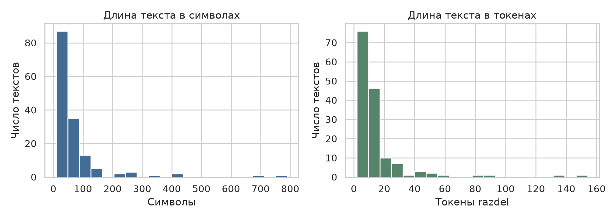
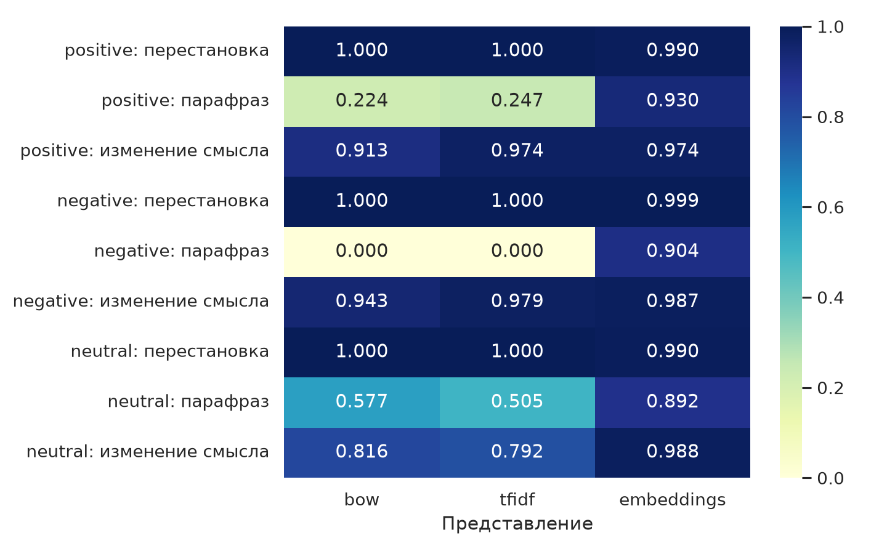

# Лабораторная работа № 1. Один текст — разные представления

Дисциплина: «Автоматическая обработка текста». Выполнили: Дущенко Даниил Александрович и Коваленко Евгений Юрьевич, группа К3341. Преподаватель: Гусарова Наталия Федоровна. Университет ИТМО, Санкт-Петербург, 2026.

## Введение

В этой работе мы исследовали, какие свойства русскоязычного текста сохраняются при переходе к вычислительному представлению. Сходство векторов удобно для поиска похожих сообщений, но не тождественно совпадению смысла. Мы сравнили четыре представления: поверхностные признаки, bag-of-words, TF–IDF и sentence embeddings. Эксперимент построен на контролируемых преобразованиях: перестановке, парафразе и изменении смыслообразующего элемента. Численные результаты сопоставляются с заранее сформулированными семантическими суждениями.

## Данные и предварительная проверка

Мы использовали 150 сообщений RuSentiment [1]. Основной репозиторий больше не распространяет корпус, поэтому данные получены из публичного форка strawberrypie/rusentiment. Ссылка, контрольная сумма исходного файла и процедура отбора сохранены. Выборка взята из обучающей части общей подготовки с random_state=42; оставлены positive, negative и neutral. Классы speech и skip исключены. Это трёхклассовый учебный срез, а не воспроизведение исходной пяти-классовой задачи статьи.

В выборке 82 нейтральных, 46 положительных и 22 отрицательных сообщения. Пропусков и повторяющихся текстов после подготовки нет. В полном исходном файле случайных сообщений обнаружено 74 дубликата; удаление выполнено до отбора. Средняя длина равна 69,81 символа, медиана — 40,5, максимум — 789. Для токенов razdel среднее составляет 14,47, медиана — 9, максимум — 154. Разница среднего и медианы отражает длинный правый хвост: небольшое число длинных сообщений заметно влияет на среднее.

## Методика

Поверхностное представление содержит число символов, токенов и предложений, восклицательных и вопросительных знаков, а также долю заглавных букв среди букв. Такие признаки описывают форму сообщения и могут отражать эмоциональную подачу, но не указывают, о чём именно говорит автор. Например, два противоположных утверждения способны иметь почти одинаковую длину и пунктуацию. Все признаки сохранены построчно с исходными идентификаторами.

Для bag-of-words и TF–IDF мы использовали CountVectorizer и TfidfVectorizer. Токенизация выполняется razdel, регистр понижается, чистая пунктуация исключается. Лемматизация и удаление стоп-слов не применяются: важно сохранить отрицание «не». Словарь и IDF обучаются только на 150 исходных текстах. Изменённые варианты преобразуются уже готовыми векторизаторами. Поэтому эксперимент также выявляет проблему неизвестных слов; доля OOV сохранена отдельно для каждой пары.

Плотное представление строится sentence-transformers с multilingual-e5-small [2]. Для симметричного сравнения обе стороны получают одинаковый префикс query:, векторы нормируются. Мы вычислили эмбеддинги на CPU, поэтому запуск работы не требует свободной видеокарты. Размерность и параметры модели записаны в embedding_config.json. Для каждого преобразования мы рассчитали косинусное сходство с оригиналом; всего получено девять пар. Поверхностные признаки не включены в косинусное сравнение: задание требует его для трёх остальных представлений.

Мы выбрали оригиналы трёх классов: положительное сообщение о спокойной песне, отрицательное сообщение о глупых репостах и нейтральный вопрос о времени выезда. При конструировании преобразований мы заранее сформулировали семантические решения и обоснования, чтобы затем сопоставить их с численным сходством. Для парафраза вопроса сохраняется основное содержание, хотя эмоциональный оттенок обращения немного ослабляется.

## Результаты девяти сравнений

| Класс и преобразование | BoW | TF–IDF | E5 |
|---|---:|---:|---:|
| Positive: перестановка | 1,000 | 1,000 | 0,990 |
| Positive: парафраз | 0,224 | 0,247 | 0,930 |
| Positive: изменение смысла | 0,913 | 0,974 | 0,974 |
| Negative: перестановка | 1,000 | 1,000 | 0,999 |
| Negative: парафраз | 0,000 | 0,000 | 0,904 |
| Negative: изменение смысла | 0,943 | 0,979 | 0,987 |
| Neutral: перестановка | 1,000 | 1,000 | 0,990 |
| Neutral: парафраз | 0,577 | 0,505 | 0,892 |
| Neutral: изменение смысла | 0,816 | 0,792 | 0,988 |

Перестановка не меняет unigram-счётчики, поэтому обе разреженные модели возвращают ровно единицу. Этот результат следует из определения представления, а не доказывает языковое понимание. Эмбеддинги немного меняются, поскольку модель чувствительна к последовательности. Для парафразов плотное представление существенно лучше сохраняет близость: значения 0,892–0,930 против 0–0,577 у разреженных методов. Однако часть падения BoW объясняется малым словарём и морфологическими различиями, а не только заменой смысла.

## Три несоответствия близости и смысла

Первый случай: «Обожаю её» заменено на «Не обожаю её». Утверждение о восхищении отрицается, но TF–IDF даёт 0,974 и E5 — 0,974. Почти весь словарь и тема песни сохранены; частое короткое отрицание мало меняет направление вектора. При этом новая фраза не обязательно означает ненависть: корректный вывод ограничен отсутствием прежнего утверждения.

Второй случай: «у тебя одни глупые репосты» превращается в «у тебя не одни глупые репосты». Меняется область отрицания и всеобщность оценки: допускаются другие публикации. BoW остаётся равным 0,943, TF–IDF — 0,979, E5 — 0,987. Плотная модель в этой паре даже менее чувствительна, чем простое счётное представление. Тематическая близость не позволяет восстановить логический квантор.

Третий случай: «Когда выезжаешь» заменено на «Когда приезжаешь». Оба сообщения относятся к поездке, но запрашивают разные события и обычно разные моменты времени. E5 показывает 0,988 — больше, чем для смыслосохраняющего парафраза этого же вопроса. Разреженные методы замечают замену слова сильнее, однако сами не объясняют различие выезда и прибытия. Следовательно, универсальный порог сходства не решает задачу эквивалентности.

## Заключение

Поверхностные признаки сохраняют форму, BoW — лексический состав, TF–IDF — взвешенный лексический состав, E5 — более широкую тематическую и семантическую близость. Плотные векторы полезнее для перефразирования, но могут игнорировать отрицание и замену события. Девять специально выбранных пар иллюстрируют механизм ошибки, а не оценивают её частоту в языке. Для задач, где важны противоположные утверждения, после поиска похожих текстов необходима отдельная проверка содержания. Мы последовательно выполнили notebook; исходные данные, преобразования, матрицы, графики и таблицы сохранены для повторного запуска.

## Список использованных источников

[1] Rogers A. et al. RuSentiment: An Enriched Sentiment Analysis Dataset for Social Media in Russian. COLING, 2018. URL: https://aclanthology.org/C18-1064/ (дата обращения: 08.09.2026). Данные: https://github.com/strawberrypie/rusentiment.

[2] intfloat. Multilingual E5 small: model card. URL: https://huggingface.co/intfloat/multilingual-e5-small (дата обращения: 08.09.2026).